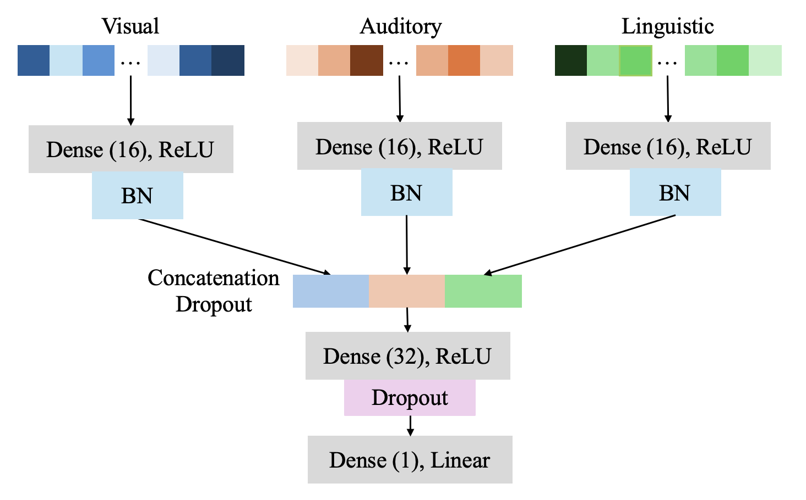

# Multimodal Drivers of Attention Interruption to Baby Product Video Ads

This repository contains the code and data for the paper titled "Multimodal Drivers of Attention Interruption to Baby Product Video Ads," published at ICPR 2024.


## Table of Contents

- [Dataset](#dataset)
- [Model](#model)
- [Feature Extraction and Analysis](#feature-extraction-and-analysis)
- [How to Run](#how-to-run)
- [Results](#results)
- [Contact](#contact)
- [Citations](#citations)

## Dataset

The dataset used in this study consists of video ads for baby products, annotated with viewers' points of interest during their viewing of the ads.


We extracted visual, audio, and linguistic features along with an attention interruption measure. The feature extraction code can be found in the `feature extraction` folder.

- **Visual Features:** Extracted using image processing techniques, including 78 features such as color, texture, and object detection.
- **Audio Features:** Extracted from the audio tracks of the videos, including 63 features such as RMS, pitch, and spectral features.
- **Linguistic Features:** Derived from the textual content of the ads, encompassing 156 features such as sentiment, complexity, and thematic elements.

We have also split the dataset into training and testing datasets for future research. All datasets can be found in the `dataset` folder.

## Model

We built a multimodality feature-infused model for predicting attention interruption. The model is visualized below:



Our model outperformed benchmark models in predicting attention interruption, as shown in the table below:


## Feature Extraction and Analysis

We employed a linear regression model to analyze the relationship between multimodal features and attention interruption. The code for feature reduction and regression estimation can be found in the `feature importance` folder.

## How to Run

1. Clone the repository:
   ```bash
   git clone https://github.com/ostadabbas/Baby-Product-Video-Ads
   cd attention-interruption-baby-ads
   ```
